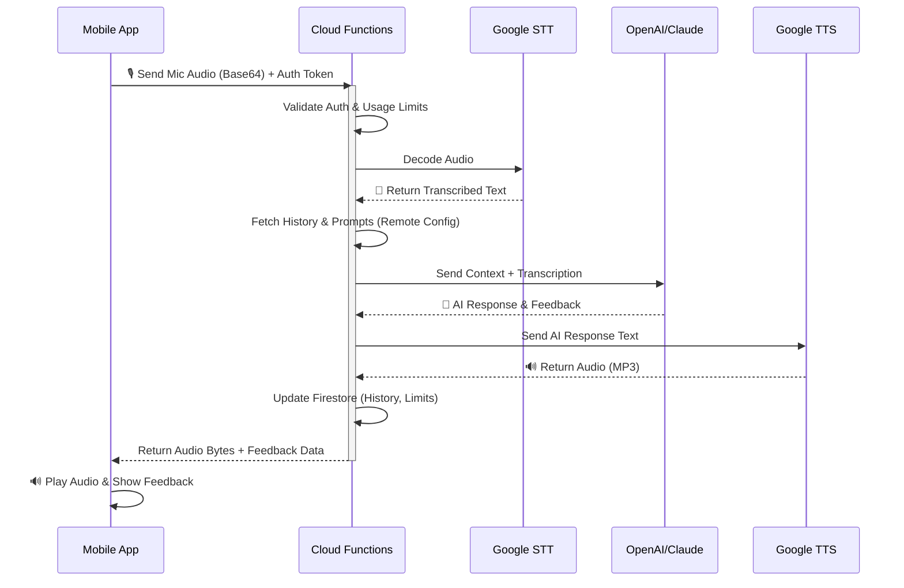

<div align="center">
  
  
  <p align="center">
    <strong>A voice-first, AI-powered conversational English tutor designed exclusively for Sinhala speakers.</strong>
  </p>
  
  <p align="center">
    
    
    
    
    
    
    
  </p>
</div>

---

## 🌟 Overview

**Talk Sarasavi** bridges the gap for Sinhala speakers who want to learn English through immersion, but in a safe, non-intimidating environment. Unlike traditional apps that rely on typing or mechanical memorization, Talk Sarasavi acts as a **conversational AI tutor**. 

It begins by communicating heavily in Sinhala and progressively shifts to English as the user's confidence and vocabulary grow.

### 🎯 Key Features
* 🎙️ **Voice-Only Interface**: No text input. Total focus on speaking practice.
* 🧠 **Adaptive AI Progression**: Real-time assessment shifts the Sinhala-to-English ratio dynamically based on ability.
* ⏳ **Patience Built-In**: Advanced silence handling ensures learners have time to think and construct sentences without being cut off.
* 📊 **Smart Gamification**: Streak tracking, usage limits, and session reviews designed to motivate, not punish.

---

## 🏗️ Architecture & Tech Stack

This project follows a disciplined **NPM Workspace Monorepo** structure, strictly separating client UI from server logic to ensure maximum security and maintainability.

| Domain | Technology | Purpose |
| :--- | :--- | :--- |
| **Frontend** | React Native + Expo | Cross-platform (iOS/Android) mobile app. |
| **State & Routing** | Zustand + Expo Router | Persistent state management and file-system navigation guards. |
| **Backend** | Firebase Cloud Functions | Serverless backend logic running TypeScript. |
| **Database** | Firestore | Real-time database for user profiles, usage limits, and session history. |
| **Authentication** | Firebase Auth | Google & Apple Sign-In only (No email/password). |
| **Voice AI Pipeline** | Google Cloud STT & TTS | Audio processing for Sinhala/English speech. |
| **Conversational AI** | OpenAI / Anthropic API | LLM providing tutor logic, assessment, and dynamic responses. |
| **Dynamic Config** | Firebase Remote Config | Stores prompts, language ratios, and system configuration. |

---

## 🔄 AI Voice Pipeline

The critical path of the application. The server is the absolute authority on limits, logic, and AI generation. The client only captures audio, plays audio, and renders the UI.



---

## 📂 Monorepo Structure

The codebase is organized into specific domains. The mobile app utilizes a strict `app/` (routing) and `src/` (logic) separation.

```text
talk-sarasavi/
├── apps/
│   └── mobile/                     # React Native Expo app (iOS + Android)
│       ├── app/                    # Expo Router file-system routing
│       │   ├── (auth)/             # Unauthenticated screens (Onboarding, Login)
│       │   ├── (app)/              # Protected screens (Chat, Progress, Settings)
│       │   └── _layout.tsx         # Global navigation guards
│       ├── src/                    # Core business logic & UI components
│       │   ├── core/               # Services (Firebase, API clients)
│       │   ├── features/           # Feature slices (Auth store, Game logic)
│       │   ├── shared/             # UI atoms, theme, and models
│       │   └── assets/             # Fonts and imagery
│       └── metro.config.js         # Monorepo bundler configuration
│
├── backend/
│   ├── functions/                  # Firebase Cloud Functions (TypeScript)
│   ├── firestore/                  # Rules & Indexes
│   └── storage/                    # Storage Rules
│
├── shared/                         # Internal NPM package (@talk-sarasavi/shared)
│   ├── package.json
│   └── tsconfig.json
│
├── notes/                          # Developer handbooks and architecture studies
├── .github/workflows/              # CI/CD pipelines (Linting & Deployments)
└── package.json                    # Root workspace config
```

---

## 🚀 Implementation Roadmap

Development is split into 9 sequential phases to ensure stability and focus.

- [x] **Phase A:** Monorepo initialization & NPM Workspaces setup.
- [x] **Phase B:** Authentication & User Profile creation (State, UI, Routing Guards).
- [ ] **Phase C:** Voice Pipeline Backend (STT → LLM → TTS over Cloud Functions).
- [ ] **Phase D:** Conversation UI (Mic capture, playback, and overlay feedback).
- [ ] **Phase E:** Progress Tracking (Session summaries and progress dashboard).
- [ ] **Phase F:** Freemium Enforcement (Server-side limits & paywall UI).
- [ ] **Phase G:** Subscription System (StoreKit + Google Play Billing).
- [ ] **Phase H:** Speaking Games (Pronunciation Challenge & Sentence Completion).
- [ ] **Phase I:** Polish & Launch (App store assets, production rules, and onboarding).

---

## 🔐 Core Guiding Principles

1. **Single Source of Truth**: Logic lives in Cloud Functions, prompts live in Remote Config, data lives in Firestore.
2. **Language-Pair Agnostic**: "Sinhala" is never hardcoded. It is a configuration variable enabling zero-code expansion to other languages (e.g., Tamil → English).
3. **Server Enforces, Client Displays**: The client is never trusted. Usage limits, subscriptions, and rules are rigidly enforced by the backend Admin SDK.

<div align="center">
  <sub>Built with ❤️ for language learners everywhere.</sub>
</div>
